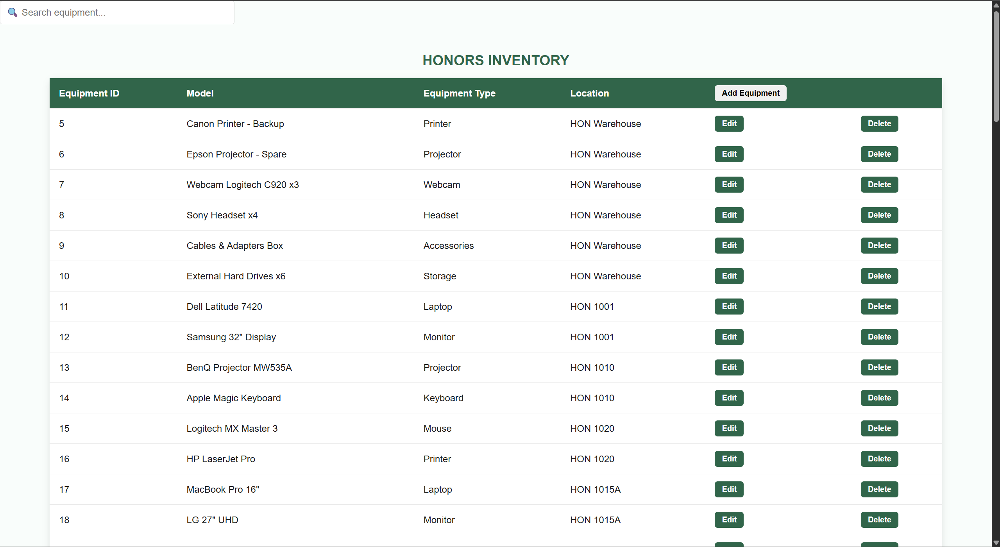

# Honors Inventory Management System

Equipment tracking with React, Express, and PostgreSQL.

## Setup

1. **Database**:  Create Supabase project, run `init.SQL` in Supabase, disable RLS
2. **Backend**: `cd backend && npm install && npm run start`
3. **Frontend**: `cd frontend && npm install && npm run dev`

Create `backend/.env`:
```
SUPABASE_URL=your_url
SUPABASE_ANON_KEY=your_key
```
Notes:\
Supabase only allows 2 free projects, so consider using a different account if you have already used up the two free projects

To get your keys, go to dashboard -> hover your cursor to the left -> find Project Settings then: 

SUPABASE URL is in the Data API section\
SUPABASE_ANON_KEY: go to API Keys, select Legacy anon, service_role API keys


Create `frontend/.env`:
VITE_API_URL = http://localhost:3001

If everything goes well it should be looking something like this:


## Features
View, add, edit, delete, and transfer equipment between locations.

## Database Schema
- **locations** - Room inventory (warehouse, classrooms, offices)
- **equipments** - Equipment items with foreign key to locations

## API Endpoints
- `GET /api/equipment` - Get all equipment with location details
- `GET /api/locations` - Get all locations
- `POST /api/equipment` - Add new equipment
- `PUT /api/equipment/:id` - Update equipment
- `DELETE /api/equipment/:id` - Delete equipment

## Tech Stack
React + TypeScript | Express | Supabase (PostgreSQL)


Changes: 
1. Fix naming errors in init.SQL
2. Changed the reference key in db from room_name to location_id
3. A search bar that is still in progress, but functional